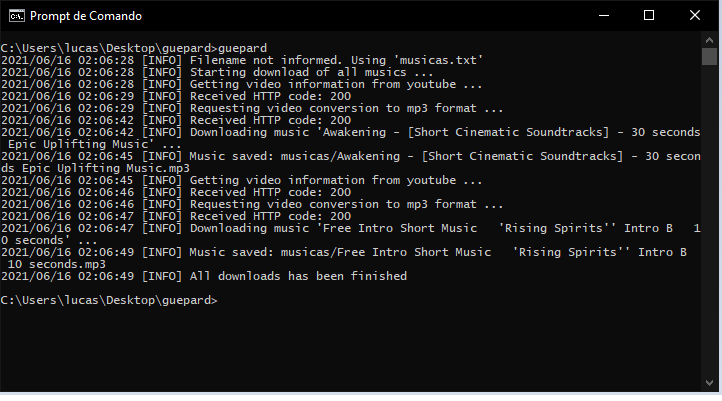

# Guepard
Programa simples para baixar músicas do youtube

# Compilar
1) Instale o go (versão 1.14 ou superior)
2) Compile o programa: ``go get -v && go build``

# Uso
Crie um arquivo chamado "musicas.txt" na mesma pasta em que está localizado o executável do programa e execute-o

# Arquivo de links
O arquivo **musicas.txt** deverá conter os links de onde serão baixadas as músicas, sendo um link por linha
[Exemplo](musicas.txt)

# Captura de tela

